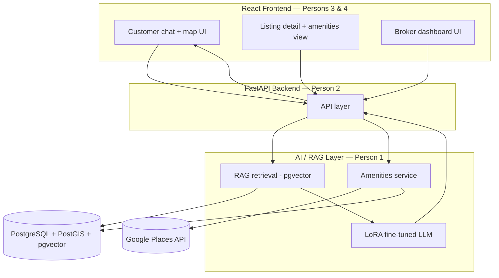

# Reality AI

**An AI-powered real estate exploration and publishing platform.**

Reality AI lets customers discover properties through a conversational, retrieval-grounded chat assistant paired with an interactive split-screen map — including free-form boundary search and cached nearby-amenities data — while brokers publish and manage listings and track engagement. Built as a final year project under the **AIDS (Artificial Intelligence & Data Science)** department, mentored by **Prof. Vivek Chapaneria**.

---

## Table of Contents

- [Overview](#overview)
- [Key Features](#key-features)
- [Architecture](#architecture)
- [Tech Stack](#tech-stack)
- [Repository Structure](#repository-structure)
- [Getting Started](#getting-started)
- [Environment Variables](#environment-variables)
- [API Reference (Summary)](#api-reference-summary)
- [Roadmap](#roadmap)
- [Team & Ownership](#team--ownership)
- [Contributing](#contributing)

---

## Overview

Rather than filtering listings through static forms, a customer describes what they're looking for in plain language. The interface responds with a live-updating split-screen view — chat on one side, an interactive monochrome map and matching property list on the other — similar in spirit to a Google Maps search-results layout, but powered by a property-domain-specific AI assistant rather than a generic one.

The current phase uses **synthetic data** for both listings and brokers, so the full pipeline can be validated end-to-end before onboarding real users.

## Key Features

- **Conversational property search** — a fine-tuned, retrieval-augmented chat assistant that answers from real listing data instead of guessing, and stays scoped to real estate rather than acting as a general-purpose chatbot.
- **Split-screen chat + map experience** — chat and results update together, live, as the conversation evolves.
- **Rough-boundary search** — customers can hand-draw a search area directly on the map instead of relying only on radius search; this combines with the chat assistant so a drawn boundary and a text query narrow results together.
- **Nearby-amenities enrichment** — each listing is enriched with cached nearby points of interest (schools, hospitals, restaurants, transit, parks) via the Google Places API, looked up once at listing-creation time — never fetched live during a search or chat request.
- **Broker publishing & analytics** — brokers create and manage listings and see views/leads per listing.
- **Production-phase roadmap item (not yet built):** AI-generated, layout-accurate room visualizations (naked and furnished) for an explorable view of a property — see each track's roadmap document for the proposed design.

## Architecture



A broker's published listing is written to the database, then both **embedded** (for semantic search) and **amenities-enriched** (via a cached Google Places lookup) — so it becomes fully discoverable through the chat assistant immediately, without either step happening live during a customer's search.

## Tech Stack

| Layer | Technology |
|---|---|
| Frontend | React (Vite), Zustand, Google Maps JavaScript API + Drawing Library |
| Backend | FastAPI, SQLAlchemy + GeoAlchemy2, Alembic, python-jose + passlib |
| Database | PostgreSQL + PostGIS (geospatial) + pgvector (embeddings) |
| AI / RAG | sentence-transformers (embeddings), custom retrieval over pgvector |
| Fine-tuning | LoRA / QLoRA via PEFT + bitsandbytes + trl, base model Llama 3 8B or Mistral 7B, debugged on Phi-3-mini |
| Compute | Local GPU (RTX 3050, Person 1) for debugging; Kaggle Notebooks (free tier) for full fine-tuning runs |
| External APIs | Google Maps JavaScript API, Google Places API (Nearby Search) |
| Data | Faker-generated synthetic listings, brokers, and customers using real-world coordinates |
| Infra | Docker + Docker Compose |

Full per-track detail (file structure, endpoint contracts, setup commands) lives in each track's implementation guide under `docs/`.

## Repository Structure

```
reality-ai/
├── ai/                      # Person 1 — RAG, fine-tuning, amenities service
│   ├── embeddings/
│   ├── rag/
│   ├── amenities/
│   ├── finetune/
│   │   └── configs/
│   └── inference/
├── backend/                 # Person 2 — FastAPI, PostgreSQL/PostGIS
│   └── app/
│       ├── core/
│       ├── models/
│       ├── schemas/
│       ├── api/
│       │   └── routes/
│       ├── services/
│       └── db/
│           └── migrations/
├── frontend/                # Persons 3 & 4 — React app
│   └── src/
│       ├── api/
│       ├── components/
│       │   ├── chat/
│       │   ├── map/
│       │   ├── listings/
│       │   └── broker/
│       ├── pages/
│       ├── state/
│       └── styles/
├── docs/                    # Roadmaps, API contract, architecture notes
├── .gitignore
└── README.md
```

## Getting Started

New to the project? Start with [`docs/Reality-AI-Initial-Setup-Guide.md`](docs/Reality-AI-Initial-Setup-Guide.md) for the full fork-based GitHub workflow. The condensed version:

```bash
# 1. Fork the repo on GitHub, then clone your fork
git clone https://github.com/<your-username>/reality-ai.git
cd reality-ai
```

**Backend (Person 2):**
```bash
cd backend
python -m venv venv && source venv/bin/activate
pip install -r requirements.txt
cp .env.example .env
docker-compose up -d db
alembic upgrade head
python -m app.db.seed_synthetic_data
uvicorn app.main:app --reload
```

**AI / RAG (Person 1):**
```bash
cd ai
python -m venv venv-ai && source venv-ai/bin/activate
pip install -r requirements.txt
python -m embeddings.embed_listings
```

**Frontend (Persons 3 & 4):**
```bash
cd frontend
npm install
cp .env.example .env
npm run dev
```

Once running: the backend serves on `http://localhost:8000`, and the frontend dev server (Vite) on `http://localhost:5173`.

## Environment Variables

| Variable | Used by | Purpose |
|---|---|---|
| `DATABASE_URL` | backend, ai | PostgreSQL connection string |
| `SECRET_KEY` | backend | JWT signing |
| `GOOGLE_PLACES_API_KEY` | ai | Nearby-amenities lookups |
| `VITE_API_BASE_URL` | frontend | Backend base URL |
| `VITE_GOOGLE_MAPS_API_KEY` | frontend | Maps JS API + Drawing Library |
| `HF_TOKEN` (optional) | ai | Pulling/pushing the fine-tuned adapter via Hugging Face Hub |

## API Reference (Summary)

| Method | Path | Purpose |
|---|---|---|
| `POST` | `/auth/register` / `/auth/login` | Broker or customer auth |
| `POST` | `/listings` | Broker publishes a listing; triggers embedding + amenities caching |
| `GET` | `/listings/{id}` | Fetch a listing, including cached amenities |
| `GET` | `/listings/search` | Radius-based search |
| `POST` | `/listings/search-boundary` | Polygon (hand-drawn) boundary search |
| `POST` | `/chat` | Customer chat message; orchestrates RAG + LLM |
| `GET` | `/brokers/{id}/analytics` | Views and leads per listing |

Full request/response shapes are documented in `docs/` per track.

## Roadmap

The project runs across **13 weeks**, in two parallel tracks (AI/backend, frontend) synced by phase gates:

| Phase | Weeks | Focus |
|---|---|---|
| 0 | 1 | Foundation & environment setup |
| 1 | 2–4 | Core data layer / core customer experience |
| 2 | 5–6 | Real AI + backend integration |
| 3 | 7–8 | Boundary search (compulsory) |
| 4 | 9 | Amenities enrichment (compulsory) |
| 5 | 10 | Performance, testing & polish |
| 6 | 11–13 | Documentation, demo prep & submission |

Full per-person, per-phase detail (objectives, tasks, gate criteria) is in each track's roadmap document under `docs/`.

## Team & Ownership

| Track | Owner(s) | Scope |
|---|---|---|
| AI / RAG | Person 1 | RAG retrieval, LoRA fine-tuning (owns the local GPU), amenities service |
| Backend | Person 2 | FastAPI, PostgreSQL/PostGIS, all API endpoints |
| Frontend | Persons 3 & 4 | React app — chat/map UI (Person 3, lead), supporting components & QA (Person 4) |

| Enrollment No. | Role |
|---|---|
| ET23BTAI043 | Team Leader |
| ET23BTAI005 | Team Member |
| ET23BTAI054 | Team Member |
| ET23BTAI026 | Team Member |

## Contributing

This repo uses a **fork-and-pull-request** workflow, not direct pushes:

1. Get added as a collaborator (Read access) so the private repo is visible to you.
2. Fork `reality-ai` to your own account and clone your fork.
3. Branch off `main`, make your change, and push to your fork.
4. Open a pull request from your fork's branch back into this repo's `main`.

Full step-by-step commands are in [`docs/Reality-AI-Initial-Setup-Guide.md`](docs/Reality-AI-Initial-Setup-Guide.md).
